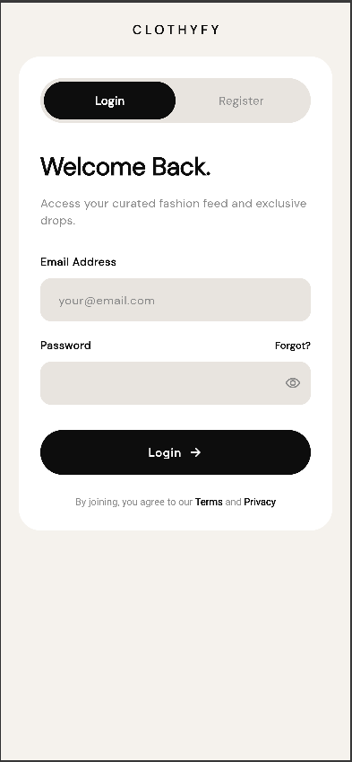
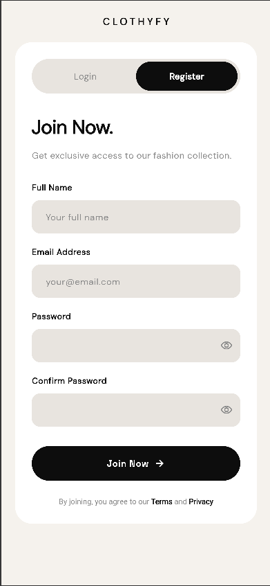
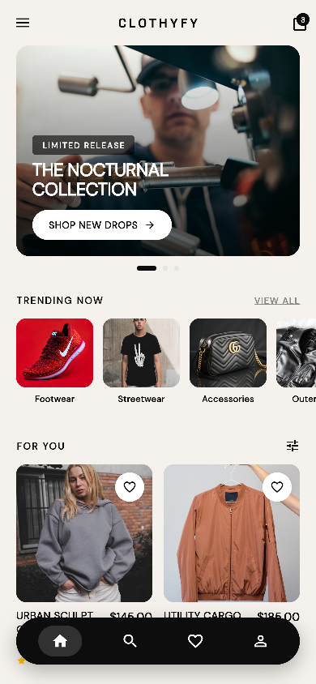
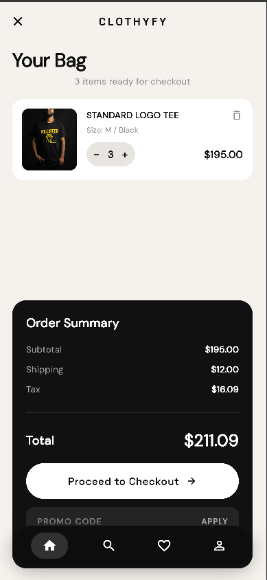
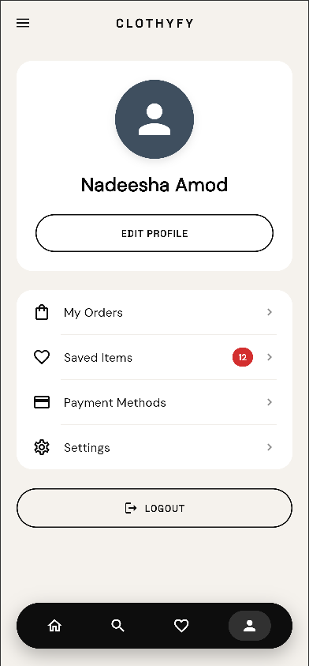

# Clothyfy-App

A modern Flutter web application for online shopping with authentication, product browsing, shopping cart, wishlist management, and user profiles.

## Overview

**CLOTHYFY** is a Phase 1 Flutter web application that showcases:

- Modern authentication (Login/Register) with tab-based interface
- Product browsing with dynamic hero banner carousel
- Shopping cart and wishlist management using Provider
- User profile with organized menu structure
- Smooth animations and transitions throughout
- Responsive design optimized for web platform

---

## Screenshots

### Login Screen


### Register Screen


### Home Screen


### Product Listing


### Cart Screen


### Profile Screen



---

## Key Features

### 1. **Authentication (Login/Register)**

- Tab-based interface switching between Login and Register screens
- Form validation with email/password fields
- Visibility toggles for password fields
- Modern avatar (person icon on navy background)
- Smooth FadeSlideTransition animations on navigation

### 2. **Home Screen**

- **Hero Banner Carousel:** 3-item auto-rotating slideshow
  - Auto-advance every 4 seconds
  - 800ms smooth transitions with easeInOutCubic curve
  - Animated dot indicators (expand 6px → 24px)
- **Product Grid:** 2-column responsive layout with consistent 170px image heights
- **Bottom Navigation:** Fixed nav bar for screen switching

### 3. **Product Browsing**

- **Product Listing:** Filter/sort by category
- **Product Detail:** Size & color selection, quantity picker, add to cart/wishlist
- **Dynamic Pricing:** Based on size/color selections
- **Stock Status:** Visual feedback on availability

### 4. **Shopping & Cart**

- **Add/Remove Items:** Full quantity management
- **Cart Summary:** Running total with tax/shipping preview
- **Checkout:** Order form with payment method selection (Apple Pay/Credit Card)
- **Wishlist:** Heart icon integration for saved items

### 5. **User Profile**

- **Avatar:** 100x100 circle with person icon
- **Menu Items:** My Orders, Saved Items (with badge support), Payment Methods, Settings
- **Badge Display:** Red count badge on "Saved Items" (showing "12")
- **Logout:** Outline button with icon + text

---


## Getting Started

### Prerequisites

- Flutter SDK (v3.0+)
- Dart SDK (v3.0+)

### Installation

1. Clone the repository:
```bash
git clone https://github.com/nadeeshaamod/Clothyfy-App.git
cd Clothyfy-App
```

2. Install dependencies:
```bash
flutter pub get
```

3. Run the app:
```bash
flutter run -d chrome
```

---

## License

This project is open source and available under the MIT License.
